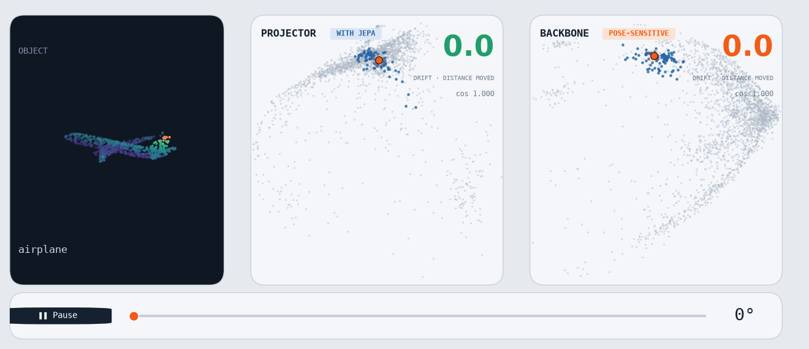
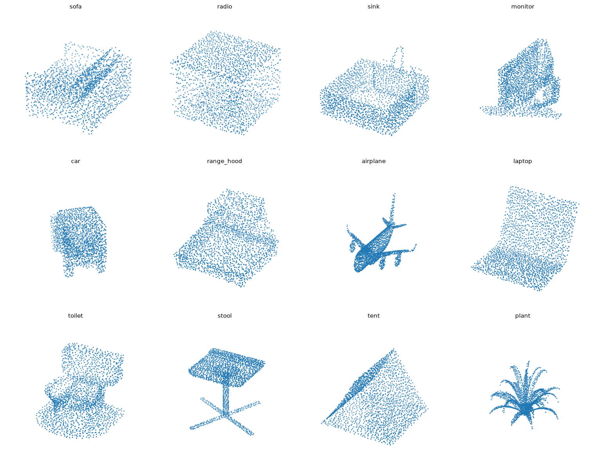
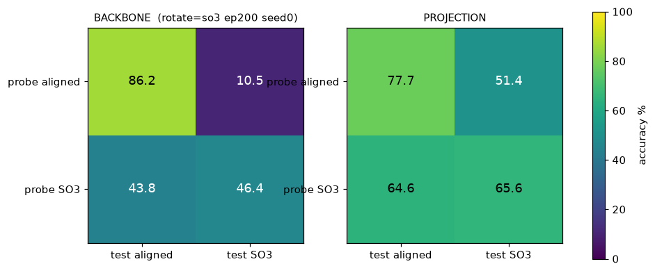
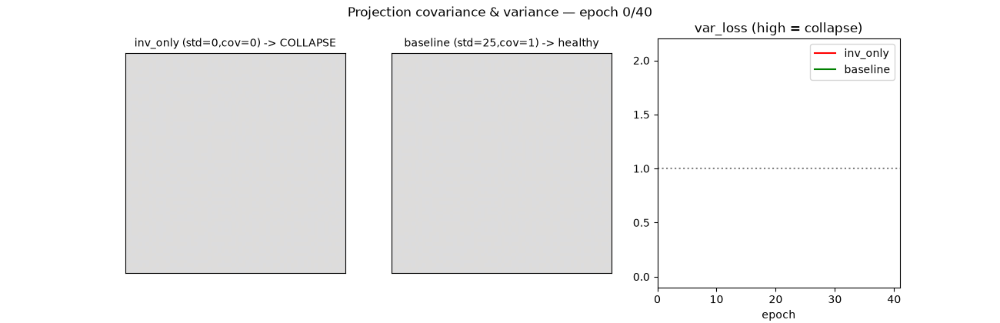
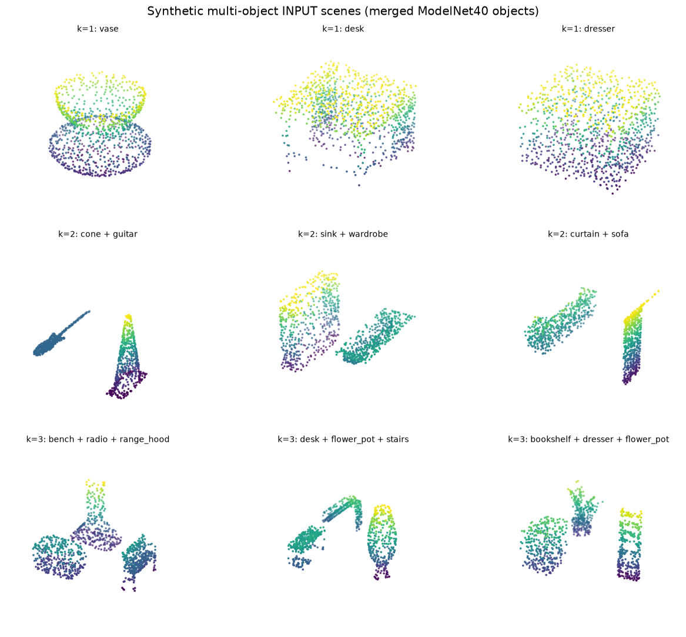
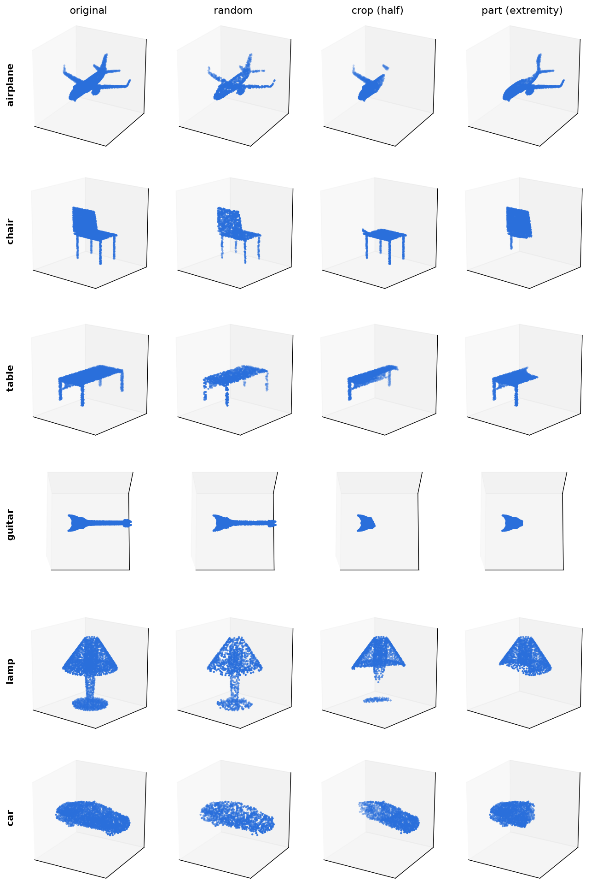
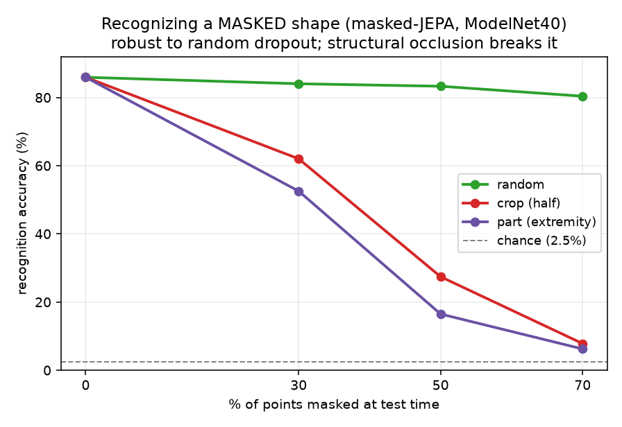
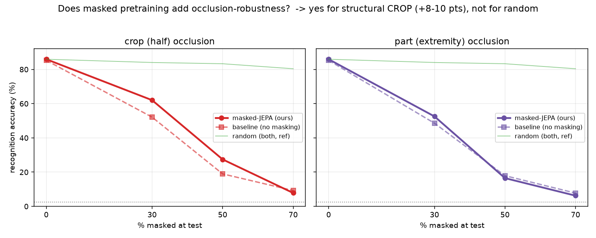

<h1 align="center">
    <p>🧊 <b>JEPA Point Cloud</b></p>
</h1>

<h2 align="center">
    <p><i>Self-supervised representations for 3D point clouds</i></p>
</h2>

<div align="center" style="line-height: 1;">
  
  
  
  
  
  <a href="https://helloelora.github.io/jepa-point-cloud/demo/"></a>
</div>

<br>

<p align="center">
  A PointNet encoder trained with <b>no labels</b> reaches <b>86.0% linear-probe accuracy</b><br>
  on ModelNet40 (40 classes, 2.5% chance). Four experiments dig into what it actually learns:<br>
  where rotation invariance lives, when training collapses, whether it scales to scenes,<br>
  and how well it recognizes shapes that are partly hidden.
</p>

<p align="center">
  
</p>

<p align="center">
  <b><a href="https://helloelora.github.io/jepa-point-cloud/demo/">▶ Spin the shapes yourself in the interactive demo</a></b>
</p>

> Built during the **[Hack the World(s)](https://hacktheworlds.fr/)** hackathon (Track 6, 3D point clouds), on the [EB-JEPA](#-credits) framework. The encoder, the self-supervised loss, the linear probe, and the masked variant below are my work.

<p align="center">
  <sub>
    Under the sponsorship of <b>Yann Le Cun</b>, Turing Award
  </sub>
</p>

---

## 📊 Results at a glance

| Question | Finding |
|---|---|
| Does label-free SSL learn useful features? | **86.0%** probe vs 2.5% chance, 83.8% random-encoder floor |
| Where does rotation invariance live? | In the projector head (**51%**), not the backbone (**10%**) |
| Is the anti-collapse term load-bearing? | Drop it and the probe falls to **82.5%**, below the random floor |
| Does it generalize to multi-object scenes? | No. mAP drops to chance once a scene holds 2+ objects |
| Can it recognize a half-hidden shape? | Yes for scattered dropout. Masked pretraining adds **+8 to +10 pts** under structural occlusion |

---

## 🧠 Method

The encoder is a PointNet: a shared MLP per point followed by a max-pool, so the output ignores point ordering. Training uses two augmented views of the same cloud (random rotation, jitter, scale, resampling) and a [VICReg](https://arxiv.org/abs/2105.04906) objective: pull the two views together (invariance), keep each feature's variance up (anti-collapse), and decorrelate features (covariance). No labels anywhere. To read out quality, I freeze the encoder and fit a single linear layer on the features (`src/eval.py`).

<p align="center">
  
</p>

---

## 🔬 Experiments

### 1. Does it learn anything? (86% probe)

A frozen self-supervised encoder, one linear layer on top. The probe scores **86.0%** on the ModelNet40 test split. Two controls make that number mean something: chance is 2.5%, and a *random, untrained* encoder of the same shape already gets 83.8% (PointNet's max-pool is a strong inductive prior). So the SSL signal is real but the honest headline is "86 vs an 84 floor", not "86 vs 2.5".

### 2. Where does rotation invariance live?

This is the result I find most interesting. I trained under three rotation regimes (none, gravity-axis only, full SO(3)) and probed both the **backbone** features and the **projector** output, aligned vs randomly rotated at test time.

<p align="center">
  
</p>

Under full SO(3) test rotations, the backbone collapses to **10%** while the projector holds at **51%**. The invariance the model is trained for ends up concentrated in the projection head, the part you normally throw away. The backbone stays largely pose-sensitive. That is a useful caution: "VICReg makes the encoder rotation-invariant" is too quick a claim.

The GIF at the top shows it live: spin one object and track where its embedding lands in a fixed PCA of the whole test set. In the **projector** space the point barely moves (cosine similarity stays at 0.99, drift near zero). In the **backbone** space the same rotation drags it across the map. A randomly initialized encoder drifts even further. Same encoder, two heads, opposite behavior.

### 3. When does training collapse?

VICReg's variance and covariance terms exist to stop the encoder from mapping every shape to the same vector. I ablated them. With invariance only, the features collapse: variance flatlines and the probe drops to **82.5%**, below the random-encoder floor. The regularizer is not decoration, it is what makes the run work.

<p align="center">
  
</p>

### 4. Does it generalize to scenes? (honest negative)

I built synthetic scenes with *k* objects and tested retrieval. At k=1 the encoder works (~83% mAP). At k≥2 it drops to chance. A single global max-pool cannot separate co-occurring objects, so the global-feature recipe does not transfer to scenes without a per-object mechanism.

<p align="center">
  
</p>

### 5. Recognizing masked shapes (masked I-JEPA)

The neighbouring team showed a nice demo: hide part of a model, still recognize it. I rebuilt it as a **masked I-JEPA** (`src/mask_ijepa.py`). A context encoder sees a *partial* cloud, a predictor maps it to a latent, and an EMA target encoder sees the *full* cloud. The context latent is trained to predict the target latent (cosine loss, plus a variance hinge for collapse). Three occlusion strategies:

- **random**: scattered point dropout
- **crop**: cut a coherent half along a random plane
- **part**: remove a protruding extremity (a wing, a leg)

<p align="center">
  
</p>

Then I measured recognition as a function of how much is hidden, against a vanilla two-view baseline with no masking.

<p align="center">
  
  
</p>

The verdict is specific:

| Occlusion | 30% hidden | 50% hidden | 70% hidden |
|---|---|---|---|
| random (masked) | 84.0 | 83.3 | 80.4 |
| **crop (masked)** | **62.0** | **27.4** | 7.8 |
| crop (baseline) | 52.1 | 19.0 | 9.2 |
| part (masked) | 52.6 | 16.5 | 6.2 |

Masking buys nothing on random dropout, because subsampling is already what the encoder sees during training. It buys **+8 to +10 points on structural crops** at 30 to 50% occlusion, the case that actually matters. Everything degrades to noise past 70%, when too little of the shape is left to identify.

---

## 🚀 Run it

```bash
pip install -r requirements.txt
# data: ModelNet40 "modelnet40_ply_hdf5_2048" release

# self-supervised pretraining
python -m examples.pointcloud.main --config-name train

# frozen linear probe
python -m examples.pointcloud.eval --ckpt <run>/latest.pth.tar

# masked I-JEPA + masked-recognition eval
python -m examples.pointcloud.mask_ijepa ROT=so3 MASK=mix RATIO=0.5 EPOCHS=100 OUT=<run>
python -m examples.pointcloud.eval_masked --ckpt <run>/latest.pth.tar

# rotation-invariance embedding-drift demo (GIF + interactive page)
python -m examples.pointcloud.embed_drift --ckpt <run>/latest.pth.tar --out <dir>
python src/render_drift.py <dir>/embed_drift.json assets/rotation_embedding.gif
python demo/build_demo.py        # -> self-contained demo/index.html
```

The scripts import the EB-JEPA package, so place `src/` under `examples/pointcloud/` of an EB-JEPA checkout (or set `PYTHONPATH` to it).

<details>
<summary><b>📂 Repo layout</b></summary>

```
src/        encoder + SSL (main.py), linear probe (eval.py),
            masked I-JEPA (mask_ijepa.py, eval_masked.py),
            embedding-drift demo (embed_drift.py, render_drift.py),
            analysis + visualizations
assets/     figures and GIFs used above
results/    raw metrics (JSON)
```
</details>

---

## 🔭 What I would try next

- Give the backbone the invariance instead of the projector: heavier rotation augmentation, or a rotation-equivariant layer, then re-run experiment 2.
- Replace global max-pool with per-point features so scenes (experiment 4) become tractable.
- Sweep the masked I-JEPA per strategy (crop-only, part-only) rather than the mixed schedule, to push the structural-occlusion gain further.

---

## 🙏 Credits

Encoder and loss build on **[EB-JEPA](https://github.com/Trick5t3r/eb_jepa)**, the energy-based JEPA framework used for the hackathon. Dataset: **ModelNet40**. Training compute: the [Hack the World(s)](https://hacktheworlds.fr/) cluster and CentraleSupelec "la Ruche" HPC (A100).
